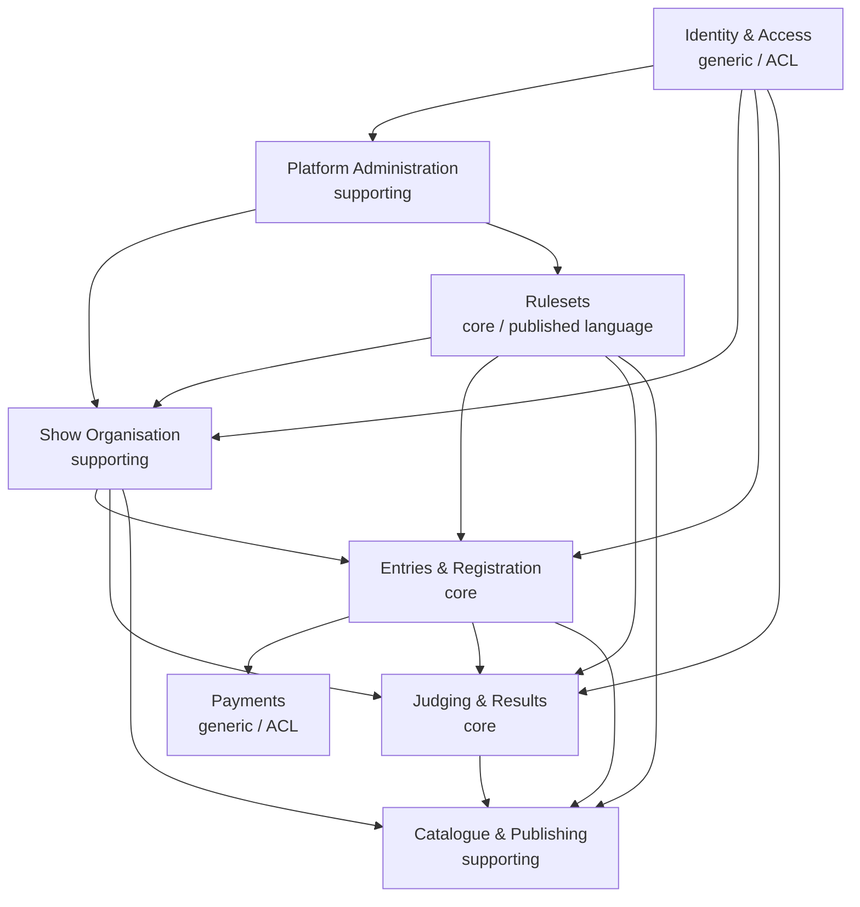

# Context Map

The domain of the open-source conformation dog-show platform, split into bounded contexts. Per-context terms live (for now) as sections in [`CONTEXT.md`](./CONTEXT.md); they will move to `src/<context>/CONTEXT.md` when code lands. Architectural rationale is in [ADR-0002](./docs/adr/0002-bounded-contexts-and-event-driven-integration.md); the ruleset mechanism is in [ADR-0001](./docs/adr/0001-kennel-club-rulesets-as-data-first-policies.md).

## Contexts

| Context | Class | Responsibility |
| --- | --- | --- |
| **Rulesets** | Core | Owns the rule vocabulary and the `Effective Ruleset` (data + the policy ports from ADR-0001 + catalogue-publication rules). The upstream Published Language. |
| **Entries & Registration** | Core | Dog identity (incl. owner-asserted `Title`s), exhibitor-side people, and the online-entry loop (entry, open/close, extras). |
| **Judging & Results** | Core | Per-Show ring outcomes: grades, placements, awards. |
| **Show Organisation** | Supporting | Club + Show Secretary set up Shows, classes, and rings. Upstream to Entries, Judging, and Catalogue. |
| **Catalogue & Publishing** | Supporting | Catalogue (produced after entries close, published under ruleset timing rules) and results publication (live or post-show). |
| **Payments** | Generic | Entry-fee collection. Behind an anticorruption layer to an external payment provider. |
| **Identity & Access** | Generic | User accounts, login, permissions. Behind an anticorruption layer to an external identity provider. |
| **Platform Administration** | Supporting | Platform operator's back office: club/tenant onboarding, the `Ruleset Catalog` (installed rulesets + versions), and global config. Upstream to Show Organisation and Rulesets. |
| **Membership** | *(Fog)* | Parked add-on; not required to enter. No model yet. |

## Relationships

Integration is via **domain events + reference-by-ID** — contexts never share mutable entities; they emit facts and reference each other by id (see ADR-0002).

- **Rulesets → (all)**: **Published Language / Conformist.** Rulesets publishes the `Effective Ruleset` shapes and policy-port interfaces; every consumer conforms. It never depends on any consumer.
- **Show Organisation → Entries & Registration**: upstream/downstream. A Show (with its resolved `Effective Ruleset`, classes, rings) must exist before entries open. Emits `ShowOpened`, `EntriesClosed`.
- **Entries & Registration → Payments**: `Entry` requests fee collection; Payments (ACL to provider) emits `EntryPaid` / `PaymentFailed`.
- **Entries & Registration → Judging & Results**: closed entries become the judging schedule. Emits `EntriesClosed`; Judging consumes it.
- **Judging & Results → Catalogue & Publishing**: ring results drive results publication. Emits `ClassJudged`, `AwardGranted`; Catalogue publishes live or post-show.
- **Entries & Registration → Catalogue & Publishing**: closed entries drive catalogue generation (ruleset-timed publication).
- **Titles are not a context** — a `Title` is owner-asserted data on the Dog (Entries & Registration); the platform never computes or confirms Titles (authoritative confirmation is external, NCO/FCI).
- **Identity & Access → (Show Organisation, Entries, Judging, Platform Administration)**: **ACL.** Provides authenticated `User`s and permissions; domain roles (Show Secretary, Exhibitor, Judge, Platform Administrator) map onto Users.
- **Platform Administration → Show Organisation**: onboards/provisions Clubs (tenants). Emits `ClubOnboarded`.
- **Platform Administration → Rulesets**: curates the `Ruleset Catalog` (which rulesets/versions are available); Rulesets draws on it when resolving a Show's `Effective Ruleset`.

