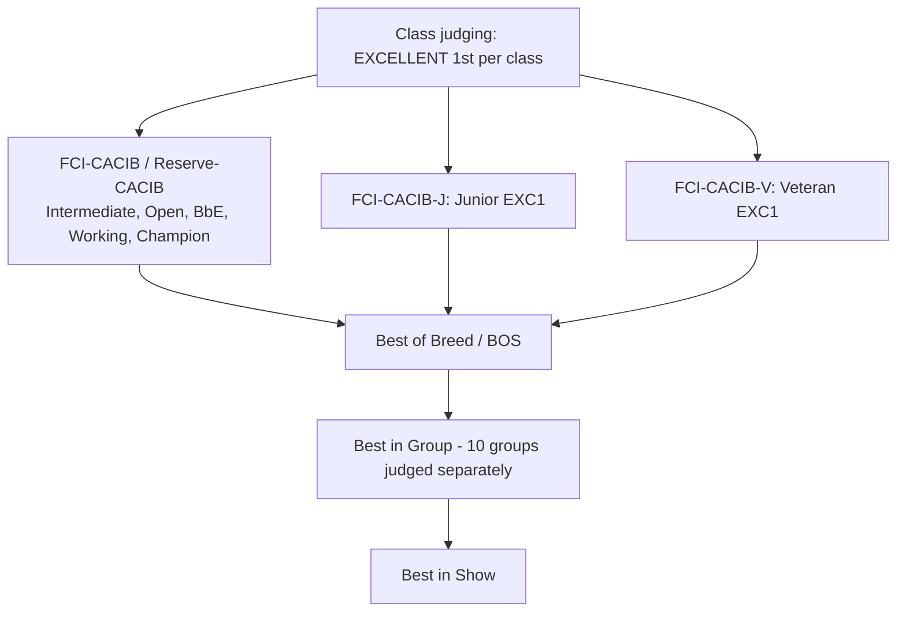

# Research: FCI international conformation show rules

**Scope & method.** All facts below are drawn from two primary FCI regulation PDFs hosted on the official FCI site, `fci.be`, read in full via a text-extraction proxy (the FCI PDFs do not render as plain text directly):

- **Regulations for FCI Dog Shows** (+ Complementary rules for World and Section Shows) — `https://www.fci.be/medias/EXP-REG-en-20270101-22481.pdf` (English is the authentic text; consolidated version carrying changes approved through May 2025 Budapest, effective 1 Jan 2027).
- **Regulations for the FCI International Championship** (titles/certificates) — `https://www.fci.be/medias/FCI-REG-TIT-en-19872.pdf` (21 pp.; amendments to March/September 2024).
- Supporting eligibility text: FCI International Championship landing page — `https://www.fci.be/en/FCI-International-Championship-41.html`.

A structural note that matters for a domain model: **the FCI regulations sit *above* national member rules and only govern the international award.** The Show Regulations state they "supplement the Standing Orders of the FCI **only in respect of those dog shows in which a … FCI-CACIB … can be awarded**." Everything national (the CAC, national champion titles, Baby classes, etc.) is explicitly delegated to the National Canine Organisations (NCOs).

---

## 1. International classes and their definitions

The Show Regulations, §5 ("Classes"), define a **closed list** of classes recognised at FCI-CACIB shows. The decisive date for age is **the day the dog is shown**. (Source: Show Regulations §5.)

**a. Classes in which the FCI-CACIB *can* be awarded** (all "compulsory"):

| Class | Age / eligibility |
|---|---|
| Intermediate | from 15 and less than 24 months |
| Open | from 15 months |
| Bred by Exhibitor | from 15 months; must be handled by its breeder (or co-breeder) throughout the show |
| Working | from 15 months; requires FCI **Working Class Certificate (WCC)** confirming a passed working test; only breeds listed as working breeds in the FCI Nomenclature are eligible |
| Champion | from 15 months; requires a confirmed champion title by the entry closing date — CIB, CIE, national Beauty Champion of an FCI member/contract partner (earned with ≥2 CACs), national Show Champion, or the equivalent from a non-FCI country holding a letter of understanding with the FCI |

**b. Classes in which the FCI-CACIB *cannot* be awarded** (compulsory):

| Class | Age |
|---|---|
| Minor Puppy | correctly inoculated puppies, less than 6 months |
| Puppy | from 6 and less than 9 months |
| Junior | from 9 and less than 18 months |
| Veteran | from 8 years |

**c./d. Youth & Veteran international awards:** the **FCI-CACIB-J** can be awarded in **Junior class** (9–18 months); the **FCI-CACIB-V** in **Veteran class** (from 8 years). (Source: Show Regulations §5 c–d.)

**On "Baby":** The FCI's own youngest class is **"Minor Puppy" (< 6 months)** — the FCI regulation does **not** define a separate "Baby" class. A "Baby" class (typically ~3–6 months) is a **national NCO addition**, not an FCI international class. This is a real axis of variation (see synthesis). (Source: Show Regulations §5 b, which lists Minor Puppy as the youngest FCI class.)

**Recommended judging sequence** (§5 e): Minor Puppy, Puppy, Junior, Intermediate, Open, Bred by Exhibitor, Working, Champion, Veteran.

**Optional collective competitions** (§5 g), entered via an individual class entry: Brace/Couple, Breeders' Group (3–5 dogs, same kennel name), Progeny Group (sire/dam + 3–5 first-generation offspring). (Source: Show Regulations §5 g.)

---

## 2. CACIB / CAC — international awards, Reserve-CACIB, and how they are proposed and confirmed

**FCI-CACIB** = *Certificat d'Aptitude au Championnat International de Beauté de la FCI*, the qualifying award toward the International Beauty Champion title. (Source: Show Regulations §7.)

- **Eligibility for the FCI-CACIB:** only dogs awarded **"EXCELLENT 1st"** in Intermediate, Open, Bred by Exhibitor, Working, and Champion classes are considered. The award requires the dog to be **"of superior quality"** and is **"not automatically and compulsorily linked to the EXCELLENT 1st."** (Source: Show Regulations §7.)
- **Reserve FCI-CACIB:** awarded to the **second-best** dog rated "EXCELLENT" from the same eligible classes; the dog placed 2nd in the class the CACIB winner came from may compete for the Reserve CACIB if awarded Excellent. Awarding it is **not compulsory**. (Source: Show Regulations §7.)
- **FCI-CACIB-J / FCI-CACIB-V:** from "EXCELLENT 1st" in Junior / Veteran class respectively; each NCO may add further requirements; **no Reserve** exists for these. (Source: Show Regulations §7, §9.)
- **Judge blindness to eligibility:** the judge awards the CACIB/Reserve-CACIB (and CACIB-J/-V) **purely on quality**, "without checking whether they meet the conditions regarding age and/or registration with a studbook recognized by the FCI." Eligibility checking happens later at confirmation. (Source: Show Regulations §7.)
- **Proposal → confirmation (§8):** at the show the judge issues **proposals**; exhibitor cards must read **"Subject to confirmation by the FCI."** Within **3 months** the organiser forwards the catalogue plus the CACIB/Reserve-CACIB lists (with catalogue number, dog name, studbook number, sex, breed/variety, DOB, owner, judge, class) to the **FCI Head Office**, which makes final confirmation and checks eligibility. (Source: Show Regulations §8.)
- **One award per sex/breed/variety per day/place** (§3). Only one appointed judge per sex and breed grants all awards including the CACIB (§7).

**CAC** = *Certificat d'Aptitude au Championnat*, a **national grading**. The Show Regulations are explicit: "It is up to the national canine organisations to decide in which classes and to which dogs this certificate can be awarded." The CAC counts toward a **national** champion title (per Art. 20.2 FCI Internal Rules); the first national champion title requires **≥2 CACs awarded on two different days** by FCI-recognised judges qualified for the breed. (Source: Show Regulations §7.)

**Turning a Reserve-CACIB into a CACIB** (Title Regulations §III.3): a RCACIB is **automatically** upgraded if the CACIB went to a dog already holding a confirmed CIB. Otherwise it can be upgraded **only at the owner's/NCO's request** if the CACIB winner: (1) lacks an FCI-recognised or complete (3-generation/14-dog) pedigree; (2) was entered in a wrong class making it ineligible; (3) already met the full CIB requirements on the show day; (4) is a working-breed dog already holding a CIE; or (5) the CACIB was cancelled for any other reason. A dog that itself already holds CIB/CIE can **never** have its RCACIB upgraded. Official Annex 3 form is compulsory. (Source: Title Regulations §III.3.)

---

## 3. Titles — International Beauty Champion (C.I.B. / C.I.E.) and qualifications

General eligibility for **any** FCI International Champion title (Title Regulations, Introduction): the dog must belong to a breed **definitively recognised** by the FCI, be registered in an FCI-recognised studbook (appendix registrations do not count), and be **pure-bred** (pedigree with ≥3 complete generations / 14 dogs in FCI-recognised studbooks). (Source: Title Regulations, Introduction.)

**C.I.B. — International Beauty Champion, breeds NOT subject to a working test** (§I.1):
- **4 CACIB**, earned in **3 different countries** under **3 different judges** (regardless of number of dogs competing);
- a minimum of **one year and one day** must elapse between the first and last CACIB;
- application filed by the NCO of the owner's country of legal residence; FCI form Annex 1a (or 1b) compulsory.

**C.I.B. — breeds subject to a working test** (§I.2):
- **2 CACIB**, in **2 different countries** under **2 different judges**;
- the same **one year + one day** interval;
- **plus** a passed **breed-specific working test** in which the national working certificate (**CACT**) is competed for (the test date is not counted). Detailed per-group test requirements (IPO class 1 ≥70%, mondioring level 1 ≥80%, hunting tests, etc.) are specified in §I.2.1–I.2.5.

**C.I.E. — International Show Champion, for working breeds only** (§II): the "beauty-only" route for breeds that are subject to a working test but whose owner does not complete the working test. Requirements mirror the non-working CIB: **4 CACIB, 3 countries, 3 judges, one year + one day**, **no working test required**. Form Annex 1a/1b compulsory. (Source: Title Regulations §II.)

**Related cumulative/adjacent titles** (for completeness; §VI–XII): C.I.B.T. (Beauty + Working), C.I.T. (Working), C.I.C. (Race, sighthounds Grp 10), C.I.B.P. (Beauty + Performance, sighthounds), plus C.I.AG., C.I.OB., C.I.ROB., C.I.TR., C.I.D. Each has its own certificate (CACIT, CACIL, CACIAG, CACIOB, CACITR…). All FCI International Champion titles are **awarded by the FCI General Committee** and issued by the FCI Office once complete documents arrive (§XIII). Note the historical naming: the abbreviation is now **C.I.B.**; older documents use **C.I.E.** differently, but per current regulation C.I.B. = *Champion International de Beauté* and C.I.E. = *Champion International des Expositions* (the working-breed show-champion variant). (Source: Title Regulations §XIII.3 list of abbreviations.)

---

## 4. Judging structure — grading scale, placements, and the BOB → BIG → BIS progression

**Grading scale (adult classes), Show Regulations §6 — verbatim definitions:**
- **EXCELLENT** — very close to the ideal standard, excellent condition, high class; minor imperfections may be ignored; must show typical sex features.
- **VERY GOOD** — typical breed features, well-balanced proportions, correct condition; a few minor faults tolerated; must show class.
- **GOOD** — possesses the main breed features; good points outweigh faults.
- **SUFFICIENT** — corresponds adequately to the breed but lacks generally accepted characteristics / condition.
- **DISQUALIFIED** — does not correspond to the required type; aggressive/atypical behaviour, testicle/jaw anomalies, wrong colour/coat, albinism, or disqualifying faults (reason must be stated in the report).
- **CANNOT BE JUDGED** — dog won't move/allow examination, or signs of deception/"double handling"; dog is released from the ring (reason stated in report).

**Placements (§6):** the **four best dogs in each class are placed, provided they have at least "VERY GOOD."** (Source: Show Regulations §6.)

**Puppy / Minor Puppy scale (§6):** a separate three-tier scale — **VERY PROMISING**, **PROMISING**, **LESS PROMISING** (no CACIB implications).

**Complaints (§13):** a judge's decision on qualifications, awards and placings is **final and indisputable**; only complaints about *organisation/procedure* are admissible (with a surety of twice the entry fee).

**BOB / BOS (§7):** the FCI-CACIB-J winner, the FCI-CACIB winner, and the FCI-CACIB-V winner **from both sexes** — if awarded at least EXCELLENT — compete for **Best of Breed (BOB)**; the judge also selects **Best of Opposite Sex (BOS)**. Provisionally recognised breeds (not yet eligible for the CACIB) may still compete for BOB, Best in Group and Best in Show and for FCI titles. (Source: Show Regulations §7.)

**Best in Group (BIG) / Best in Show (BIS):** at every FCI-CACIB show the **10 FCI Groups must be judged separately** in the main ring; BIG and BIS competitions are each judged by a single pre-appointed authorised judge (§4, §7). At World/Section shows it is **compulsory for all Group Winners to compete on the last day for Best in Show** (Complementary Rules §1); BIS must be judged by an FCI International All-Breed Judge from a full member, and BIG by an FCI group judge (approved for that group) or an all-breed judge (Complementary Rules §3).

The 10 Groups (§4): 1 Sheepdogs & Cattle Dogs; 2 Pinschers/Schnauzers–Molossoids–Swiss Mountain/Cattle Dogs; 3 Terriers; 4 Dachshunds; 5 Spitz & Primitive; 6 Scenthounds; 7 Pointing dogs; 8 Retrievers–flushing–water dogs; 9 Companion & toy; 10 Sighthounds.

---

## 5. Show types — CACIB (international) vs national shows

The FCI regulation governs **only** the international layer. Key distinctions relevant to a domain model:

- **FCI-CACIB International Show** — the only event type at which the FCI-CACIB (and CACIB-J/-V) can be awarded (§1). Members must hold **≥2 CACIB shows/year** (per FCI Statutes). The FCI Head Office draws up and publishes the schedule; events must be titled **"International Dog Show with attribution of the FCI-CACIB"** and marked with the FCI logo (§1). Applications go to the FCI Head Office **6 months to 4 years** ahead (§2). Sanctioning is the responsibility of the FCI Executive Director (§3). Distance/overlap rules apply (≥300 km between same-day CACIB shows; no clash with World/Section shows on the same continent) (§3).
- **FCI World Dog Show (WDS) / Section Shows** — special CACIB shows (organised only by full members) where **FCI World/Section Winner**, **Junior Winner**, **Veteran Winner**, and **"Hope"** (Minor Puppy/Puppy) titles are additionally awarded; all Group Winners must contest BIS on the final day; stricter judge-panel rules and an official **FCI Delegate** apply (Complementary Rules, Preamble & §§1–4).
- **National shows** — governed by **NCO rules, not the FCI Show Regulations**. They award the **national CAC** and national champion titles, may run additional/native-breed competitions, and may define extra classes (e.g. Baby). The FCI text repeatedly delegates these decisions to the NCO ("It is up to the national canine organisations to decide…" §7).

---

## Where FCI and national rulesets differ (synthesis: axes a ruleset abstraction must capture)

A "ruleset/policy" abstraction with FCI-international and a national member as its two concrete inputs should be parameterised along these axes:

1. **Award vocabulary & scope.** International layer issues **CACIB / RCACIB / CACIB-J / CACIB-V** (breed-level, one per sex/breed/variety/day, quality-based). National layer issues **CAC / RCAC** with NCO-defined class scope. The abstraction needs a pluggable set of "certificates" with per-ruleset award conditions.
2. **Class catalogue & age boundaries.** FCI fixes a closed class list and ages (Minor Puppy <6m, Puppy 6–9m, Junior 9–18m, Intermediate 15–24m, Open/Working/BbE/Champion 15m+, Veteran 8y+). Nationals may **add** classes (e.g. **Baby ~3–6m**, sometimes a separate Debutant/Minor Puppy split) and may set different Champion-class entry criteria. → classes and their eligibility predicates must be data, not hard-coded.
3. **Which classes feed which award.** FCI: only Intermediate/Open/BbE/Working/Champion feed the CACIB; Junior→CACIB-J; Veteran→CACIB-V. National CAC-class mapping is NCO-defined. → a mapping "class → eligible awards" per ruleset.
4. **Grading scale.** Two scales even inside FCI: adult (Excellent/Very Good/Good/Sufficient/Disqualified/Cannot Be Judged) and puppy (Very Promising/Promising/Less Promising). Nationals may localise names/thresholds. → gradings are an enum owned by the ruleset, with a "placeable threshold" (FCI: ≥Very Good for placement; CACIB requires Excellent-1st).
5. **Title-earning economics.** CIB non-working: 4 CACIB / 3 countries / 3 judges / ≥1yr+1day. CIB working: 2 CACIB / 2 countries / 2 judges + working test. CIE: 4/3/3 without working test. National champion: ≥2 CAC on 2 days. → titles are rules over sequences of awards, parameterised by count, distinct-country, distinct-judge, elapsed-time, and prerequisite (working test) constraints.
6. **Authority / confirmation workflow.** FCI awards are **proposals "subject to confirmation"** by the FCI Head Office, with a **3-month** catalogue-submission duty and eligibility re-checking *after* the show (judge grades on quality only). National awards are typically confirmed by the NCO. → separable "propose vs confirm" states and an owning authority per award.
7. **Reserve-upgrade logic.** FCI has explicit, condition-driven rules for turning RCACIB→CACIB (pedigree completeness, wrong class, already-champion, etc.). Nationals differ. → per-ruleset upgrade policy.
8. **Show taxonomy & governance.** International (CACIB) vs World/Section (extra Winner/Hope titles, FCI Delegate, stricter panels) vs National. → a show-type dimension carrying which awards/titles are in scope, scheduling/sanctioning authority, and judge-eligibility constraints.
9. **Breed recognition status gate.** FCI: only definitively-recognised breeds get CACIB; provisionally-recognised breeds may still do BOB/BIG/BIS and titles; unrecognised breeds are catalogue-only. → a breed-status → eligibility matrix owned by the ruleset.
10. **Judge authority model.** FCI constrains who may award CACIB (Judges Directory listing) and who may judge BIG/BIS (group vs all-breed, full-member NCO). Nationals set their own licensing. → judge-competency predicates per ruleset.

---

## Sources

- Regulations for FCI Dog Shows (+ Complementary rules for World & Section Shows), FCI — `https://www.fci.be/medias/EXP-REG-en-20270101-22481.pdf` (English authentic text; consolidated to May 2025 Budapest amendments, effective 1 Jan 2027). §§1–15 + Complementary Rules used for classes, ages, grading, CACIB/CAC, BOB/BOS, BIG/BIS, confirmation, show types.
- Regulations for the FCI International Championship, FCI — `https://www.fci.be/medias/FCI-REG-TIT-en-19872.pdf` (21 pp., to 2024 amendments). Introduction + §§I, II, III, XIII used for CIB/CIE qualifications, CACIB/RCACIB upgrade rules, abbreviations.
- FCI International Championship landing page — `https://www.fci.be/en/FCI-International-Championship-41.html` (pure-bred/eligibility overview; links to the above regulation and to CIB/CIE application forms Annex 1a/1b/2).
- FCI Show Regulations index page (navigation/entry point) — `https://www.fci.be/en/Show-Regulations-72.html`.

---

## Confidence & gaps

- **High confidence** on all §1–5 facts: both governing documents were read **in full** as authentic English FCI text straight from `fci.be`. Quoted thresholds (4/3/3, 2/2/2, 1yr+1day; Excellent-1st for CACIB; ≥Very Good for placement; class ages) are verbatim from the FCI PDFs.
- **Version caveat:** the Show Regulations copy that extracted cleanly is the **consolidated version dated effective 1 Jan 2027** (carrying May 2025 Budapest changes). The separately-linked "current" file (`EXP-REG-en-17234.pdf`) would not extract through the fetcher. Substantive class/grading/CACIB structure is stable across recent revisions, but if you need the *exact* clause wording in force on a specific past date, confirm against the dated PDF for that period. The Title Regulations reflect March/September 2024 amendments.
- **Deliberately out of scope / not fully detailed here:** the working-title branches (C.I.T., C.I.C., C.I.B.P., C.I.AG., C.I.OB., C.I.TR., etc.) and their certificates (CACIT/CACIL/…) exist in the same Title Regulations and are summarised in §3 but not exhaustively transcribed, since the ticket centres on conformation (beauty) shows.
- **"Baby" class:** the FCI regulation contains **no** Baby class — its youngest is Minor Puppy (<6 m). Any "Baby" class is a national NCO construct; I did not pull a specific national ruleset here (that is the intended *second* concrete input for your abstraction). Recommend a follow-up ticket to capture one representative NCO ruleset (e.g. VDH, KC, or your target member) to validate the axes in the synthesis against a real national implementation.
- No official source was unreachable in substance — the FCI PDFs required a text-extraction proxy to read, but the content is the genuine FCI document (titles, page numbers, "English text is the authentic document" clauses all present).
